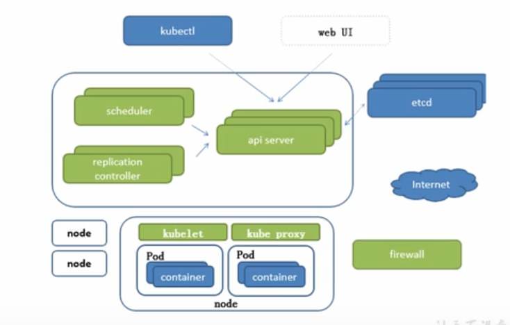
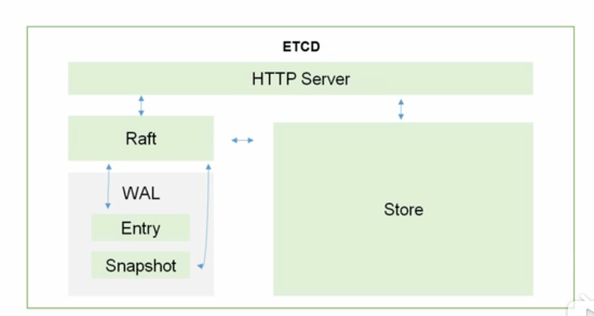

# 组件说明

```
群集最好是保持3台 5台 以上  

高可用集群副本数据最好是 >= 3
```


## k8s架构图




```
1 master 节点

2 node 节点服务器
```


## 1 master服务器组件


#### 1 . scheduler 

```mysql
把任务交给api server中  api 将请求写入到etcd
```

#### 2 . replication controller（ 期望值）（睿破类K什 康缇娜）

```mysql
它去保证 副本的期望值，当副本数不满足期望值时，会创建对应的pod或删除
```

#### 3 api server 是所有服务

```mysql
所有组件的入口，当然其他组件也会生成缓存，不是每次都要去找api server去连接
```

#### 4 etcd

```mysql
键值对数据库，保证了k8s 的数据

etcd 可以本身完成集群优化，有自己的集群化方案，例如 mysql实现读写分离需要借助 阿米巴中间件

键值存储（key/values）

#存放集群信息，当集群死亡时可以进行恢复
```

##### etcd有两个版本

```mysql
#v2 版本   把数据写入到内存中

#v3  引入本地卷存储化

#ps  在kubernetes1.11版本之前是不支持v3版本的etcd集群
```

##### etcd 组件的内部架构



```mysql
k8s 采用http协议采用c/s开发

etcd 也使用http协议

############################

reft   读写信息（存储读写信息）
	 wal    预写日志，当修改数据时， 
	      entry  临时备份（增量备份）
	      shapshot  完整备份     消耗过大，防止增量备份过大，换
	      
store  将reft的数据写入到磁盘中存储


#总结，etcd集群的必须组件，存放kubernetes必要的集群信息数据
```


## 2 node节点服务器的组件

```mysql
1 kube let          #与docker交互，进行创建容器，保证容器运行

2 kube-proxy       #默认规则是通过防护墙做端口映射
				 #pod与pod之间访问，包括负载均衡

3 docker
```

## 3 整理组件

### master组件

```mysql
1  api server   所有服务访问的统一入口 (所有组件，服务端，客户端上的所有组件的入口)

2  crontroller manager: 维持副本期望数目
#容器管理者
3  scheduler:   调度器，负责接收任务，选择合适的节点进行分配任务(有合适的资源进行)

4  etcd:      键值对数据库，存储k8s集群所有重要信息(持久化)

```

### node组件

```mysql
kubelet:   直接跟容器引擎交互实现容器的生命周期管理
#服务端发送请求，kubelet去调用本地的docker去创建容器

kube-proxy:  负责写入规则 到iptables ipvs 实现服务映射访问
```


## 4 其他组件

#### 1  coredns （喀弱dns）（重要组件）

```mysql
 可以集群中的svc创建一个域名ip的对应关系解析
 可以是西安负载均衡
#就相当于给节点pod，做一个域名解析，比如创建一个pod 命名为php, 其他pod就可以根据php的pod名称去访问 php了
```


#### 2  dashboard （大西报特）

```mysql
#给k8s提高一个/B/S结构访问体系
```


#### 3  ingress controller （英戈睿死  康缇娜）

```mysql
官方只能实现四层代理，ingress可以实现7层代理
#主机名，域名，负载均衡
```


#### 4  fedetation （佛里来西）

```mysql
#提供一个可以跨集群中心多k8s统一管理功能
```


#### 5 prometheus   (普罗米修斯)

```mysql
#提供k8s集群的监控能力
```


#### 6 elk

```mysql
#提供k8s集群日志统一分析介入平台
```


