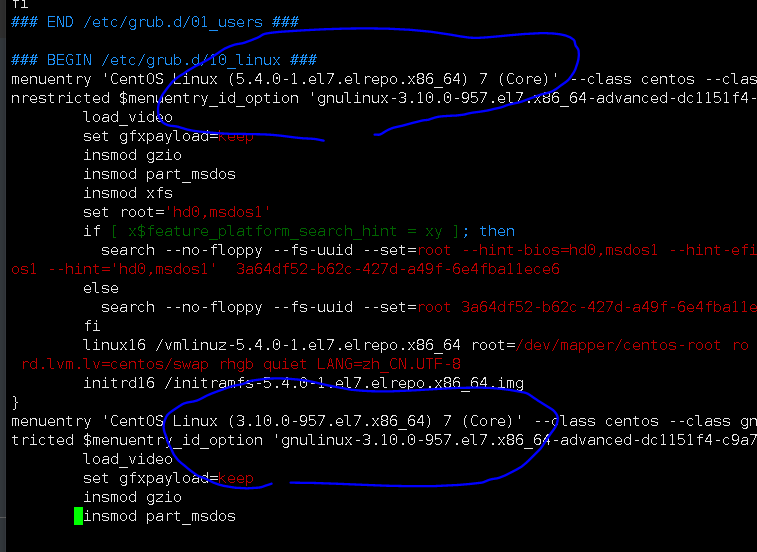
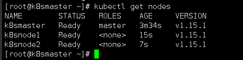
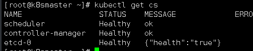
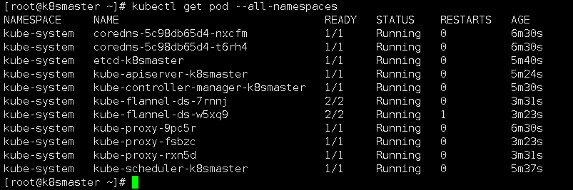
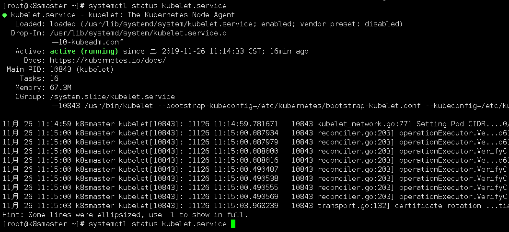
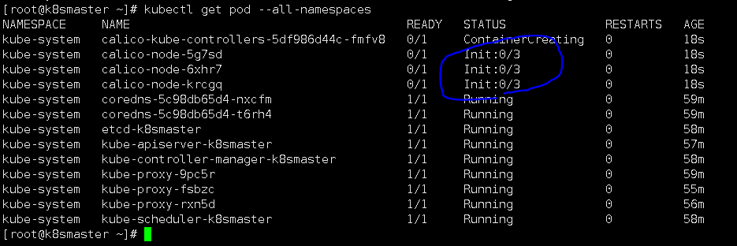

#所有节点都执行，环境，2核4G内存

## 一 k8s 前置环境（以下操作针对所有主机）

#基础环境的yum源  

```
wget -O/etc/yum.repos.d/aliyunjichu.repo.repo http://mirrors.aliyun.com/repo/Centos-7.repo 

systemctl enable docker
systemctl restart docker
```

地址解析

```
#添加本地解析
cat <<EOF>>/etc/hosts
192.168.1.20 k8smaster
192.168.1.21 k8snode1
192.168.1.22 k8snode2
EOF
```


## 1. 修改主机名

```
temp=$(ifconfig ens33 | grep "inet " | awk -F " " '{print $2}')
 if [ $temp = 192.168.1.20 ];then         
   hostname  k8smaster
   bash
  elif  [ $temp = 192.168.1.21 ];then
      hostname  k8snode1
      bash
  elif  [ $temp = 192.168.1.22 ];then
      hostname  k8snode2
      bash
  fi
```

## 2. #添加3台的免密登陆

```
#安装
rm -rf /var/run/yum.pid
yum -y install expect


ssh-keygen -t rsa -P "" -f ~/.ssh/id_rsa
```

下面的3个全都跑一遍

```
cat << EOF > /test1
#!/bin/expect
spawn ssh-copy-id root@192.168.1.20 -o StrictHostKeyChecking=no
expect "root@192.168.1.20's password: "
send "123.com\r"
interact
EOF
expect /test1 
```

```
cat << EOF > /test2
#!/bin/expect
spawn ssh-copy-id root@192.168.1.21 -o StrictHostKeyChecking=no
expect "root@192.168.1.21's password: "
send "123.com\r"
interact
EOF
expect /test2 
```

```
cat << EOF > /test3
#!/bin/expect
spawn ssh-copy-id root@192.168.1.22 -o StrictHostKeyChecking=no
expect "root@192.168.1.22's password: "
send "123.com\r"
interact
EOF
expect /test3
```


## 3. 在阿里云找K8S的源

```
https://developer.aliyun.com/mirror/kubernetes?spm=a2c6h.13651102.0.0.53322f703Lw0ic
```

vim /etc/yum.repos.d/kubernetes.repo

```
[kubernetes]
name=Kubernetes
baseurl=https://mirrors.aliyun.com/kubernetes/yum/repos/kubernetes-el7-x86_64/
enabled=1
gpgcheck=0
```


## 4. 退版本安装（15.1）（指定安装的K8S的版本服务）

查询

```
yum --disablerepo="*" --enablerepo="kubernetes" list available --showduplicates 
```

#安装特定版本（15.1，上面命令可以查询到）

```
yum -y install  --enablerepo="kubernetes" kubelet-1.15.1-0.x86_64    kubectl-1.15.1-0.x86_64 kubeadm-1.15.1-0.x86_64
```

注意：

```
要注意的是版本号是 kubelet.x86_64   1.15.1-0  这样的，要使用的话要加-， kubelet-1.15.1-0.x86_64  这样即可
```


## 5. #内核升级（所有主机）

```mysql
#查看软件包版本
yum --disablerepo="*" --enablerepo="kubernetes" list available --showduplicates 


#导入密钥
yum -y install perl
rpm --import https://www.elrepo.org/RPM-GPG-KEY-elrepo.org

yum -y install https://www.elrepo.org/elrepo-release-7.0-4.el7.elrepo.noarch.rpm
```

#查询

```
yum --disablerepo="*" --enablerepo="elrepo-kernel" list available –showduplicates
```

安装内核

```mysql
yum -y  install  kernel-ml --enablerepo=elrepo-kernel
```

#查看grub引导是否是5.4在上面

vim /boot/grub2/grub.cfg 



修改内核引导

```
grub2-set-default 0

grub2-mkconfig -o /boot/grub2/grub.cfg
```


#### #确认UUID不相同

```
cat /sys/class/dmi/id/product_uuid （UUID值不相同）
```

#### #确认MAC地址不相同

```
cat /sys/class/ens33/address
```


## 6. #关闭防护墙+selinux+ 关闭swap分区（所有主机）

```
#关闭防护墙
systemctl disable firewalld
systemctl stop firewalld

#宽容
setenforce 0
swapoff -a

#关闭selinux
sed -i 's/^SELINUX=.*/SELINUX=disabled/' /etc/selinux/config

#干掉swap分区
sed -i '/dev\/mapper\/centos-swap/d' /etc/fstab
echo "#/dev/mapper/centos-swap swap                    swap    defaults        0 0" >> /etc/fstab

#添加参数
echo "net.ipv4.ip_forward = 1" >> /etc/sysctl.conf
echo "net.bridge.bridge-nf-call-ip6tables = 1" >> /etc/sysctl.conf
echo "net.bridge.bridge-nf-call-iptables = 1" >> /etc/sysctl.conf    
echo "vm.swappiness=0" >> /etc/sysctl.conf
```

#激活参数

```
sysctl -p
systemctl daemon-reload
systemctl restart docker
systemctl enable kubelet && systemctl start kubelet
```

# 7.#关机调内存

```
poweroff
```

## （3台主机的内存调整到4G以上，内核数量调整为2G以上）开机


## 8. 查看1.15.1版本所需镜像

```
kubeadm config images list --kubernetes-version=v1.15.1
```

输出

```
k8s.gcr.io/kube-apiserver:v1.15.1
k8s.gcr.io/kube-controller-manager:v1.15.1
k8s.gcr.io/kube-scheduler:v1.15.1
k8s.gcr.io/kube-proxy:v1.15.1
k8s.gcr.io/pause:3.1
k8s.gcr.io/etcd:3.3.10
k8s.gcr.io/coredns:1.3.1
```

### 修改源为谷歌（mirrorgooglecontainers），目前只有这里有镜像

```
mirrorgooglecontainers/kube-apiserver:v1.15.1
mirrorgooglecontainers/kube-controller-manager:v1.15.1
mirrorgooglecontainers/kube-scheduler:v1.15.1
mirrorgooglecontainers/kube-proxy:v1.15.1
mirrorgooglecontainers/pause:3.1
mirrorgooglecontainers/etcd:3.3.10
mirrorgooglecontainers/coredns:1.3.1
```


## 9. 拉取镜像（所有主机）

```
docker pull mirrorgooglecontainers/kube-apiserver:v1.15.1
docker pull mirrorgooglecontainers/kube-controller-manager:v1.15.1
docker pull mirrorgooglecontainers/kube-scheduler:v1.15.1
docker pull mirrorgooglecontainers/kube-proxy:v1.15.1
docker pull mirrorgooglecontainers/pause:3.1


#上面源没有这俩包,用阿里云的
docker pull registry.cn-hangzhou.aliyuncs.com/google_containers/etcd:3.3.10
docker pull registry.cn-hangzhou.aliyuncs.com/google_containers/coredns:1.3.1
```

#### #修改镜像标签，删除旧镜像

```
#打标签
docker tag registry.cn-hangzhou.aliyuncs.com/google_containers/coredns:1.3.1  k8s.gcr.io/coredns:1.3.1

docker tag registry.cn-hangzhou.aliyuncs.com/google_containers/etcd:3.3.10  k8s.gcr.io/etcd:3.3.10


docker tag mirrorgooglecontainers/kube-apiserver:v1.15.1  k8s.gcr.io/kube-apiserver:v1.15.1
docker tag mirrorgooglecontainers/kube-controller-manager:v1.15.1 k8s.gcr.io/kube-controller-manager:v1.15.1
docker tag mirrorgooglecontainers/kube-scheduler:v1.15.1 k8s.gcr.io/kube-scheduler:v1.15.1
docker tag mirrorgooglecontainers/kube-proxy:v1.15.1 k8s.gcr.io/kube-proxy:v1.15.1
docker tag mirrorgooglecontainers/pause:3.1 k8s.gcr.io/pause:3.1
docker tag mirrorgooglecontainers/etcd:3.3.10 k8s.gcr.io/etcd:3.3.10


#清除镜像
docker rmi registry.cn-hangzhou.aliyuncs.com/google_containers/coredns:1.3.1
docker rmi registry.cn-hangzhou.aliyuncs.com/google_containers/etcd:3.3.10 

docker images | grep mirrorgooglecontainers  | awk '{print "docker rmi", $1":"$2}' | sh -x
```


## 10. 拉取网络 （所有主机）（flannel网络）或者（calico网络，推荐）

```mysql
docker pull quay.io/coreos/flannel:v0.10.0-amd64
```

#### #建立网络目录

```
mkdir -p /etc/cni/net.d/

#编辑配置文件
cat <<EOF> /etc/cni/net.d/10-flannel.conf
{"name":"cbr0","type":"flannel","delegate":{"isDefaultGateway":true}}
EOF

#建立临时目录（所有主机）
mkdir /usr/share/oci-umount/oci--umount.d -p

  #重启后会丢失，需要重新写入
mkdir  /run/flannel    
  
  #设置网络地址范围（不过重启后会丢失）
cat <<EOF>/run/flannel/subnet.env
FLANNEL_NETWORK=172.100.0.0/16
FLANNEL_SUBNET=172.100.1.0/24
FLANNEL_MTU=1450
FLANNEL_IPMASQ=true
EOF
  
```

#### 


## 11. 关机，快照 3台

#### 开机后查看状态

```mysql
systemctl enable docker
systemctl enable kubelet.service

systemctl status docker    #开启的
systemctl status kubelet.service  #没起来，因为集群没有初始化
```


#### #重新建立临时网络（所有主机）（flannel网络）

```mysql
    #刚才因为重启了，所以丢失，需要重新写入
    
      #重启后会丢失，需要重新写入
mkdir  /run/flannel    
  
  #设置网络地址范围（不过重启后会丢失）
cat <<EOF>/run/flannel/subnet.env
FLANNEL_NETWORK=172.100.0.0/16
FLANNEL_SUBNET=172.100.1.0/24
FLANNEL_MTU=1450
FLANNEL_IPMASQ=true
EOF
    
```

####       


## 12  #初始化k8s群集(master)

```mysql
kubeadm init --apiserver-advertise-address 192.168.1.20 --pod-network-cidr=10.244.0.0/16           #10.244.0.0/16是pod固定的不要改
```

### #建立目录

```mysql
mkdir -p $HOME/.kube

sudo cp -i /etc/kubernetes/admin.conf $HOME/.kube/config

sudo chown $(id -u):$(id -g) $HOME/.kube/config
```

#### #应用网络

```mysql
kubectl apply -f https://raw.githubusercontent.com/coreos/flannel/master/Documentation/k8s-manifests/kube-flannel-legacy.yml

kubectl apply -f https://raw.githubusercontent.com/coreos/flannel/master/Documentation/k8s-manifests/kube-flannel-rbac.yml
```


## 13. #从节点加入主机

```
kubeadm join 192.168.1.20:6443 --token slvhtc.qz4lt13fz3i0u6d2 \
    --discovery-token-ca-cert-hash sha256:93db4e3c4a8d24658a9070f3be84472389d5b2f10e30b67b71ccd40d213dd7ca 

```

### ps:这个加入节点的命令有效时间只有初始化后2小时有效


## 14  查看群集节点状态

```
kubectl get nodes
```




## 15  查看k8s 系统组件状态

```
kubectl get cs
```




## 16 查看网络状态

```
kubectl get pod --all-namespaces
```




看到这个界面所有都是running就是成功了


#查看K8S服务

```
systemctl status kubelet.service 
```




## 17 给主机添加tab键补全

```
locate bash_completions
locate bash_completion

source /usr/share/bash-completion/bash_completion
source <(kubectl completion bash)
source <(kubeadm completion bash)
```


###  （flannel网络缺点是每次重启都需要重新建立网络范围，我们可以改用另一个网络）


## 18. #使用calico 网络（所有主机）（到外网去下了，我这里使用之前保存的镜像文件）（未成功，慎用）

**拉取网络镜像**  

**在master上做即可**（不过要先删除刚才的flannel网络）

```
kubectl delete -f https://raw.githubusercontent.com/coreos/flannel/master/Documentation/k8s-manifests/kube-flannel-legacy.yml

kubectl delete -f https://raw.githubusercontent.com/coreos/flannel/master/Documentation/k8s-manifests/kube-flannel-rbac.yml
```


拉取网络镜像

```
#获取yaml文件
curl https://docs.projectcalico.org/v3.7/manifests/calico.yaml -O 

kubectl apply -f calico.yaml
```



init正在自动下载镜像

等一会

