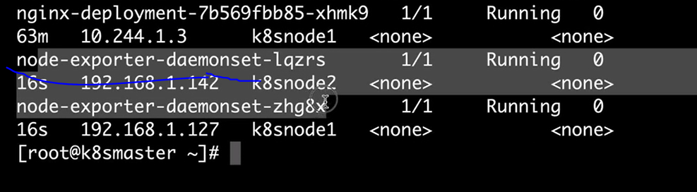

查看容器运行状态

```
kubectl edit daemonset kube-proxy  --namespect=kube-system
```


## 运行一个DeamonSet


我们之前使用命令在主机上创建了普罗米修斯的客户端

```
docker run -d -v /proc:/host/proc -v /sys/:/host/sys -v /:/rootfs --network host prom/node-exporter --path.procfs /host/proc --path.sysfs /host/sys --collector.filesystem.ignored-mount-points "^/(sys|proc|dev|host|etc)($|/)"
```

含义

```
docker run -d 
-v /proc:/host/proc 
-v /sys/:/host/sys 
-v /:/rootfs 
--network host 
prom/node-exporter       //镜像名称
--path.procfs /host/proc     //镜像参数
--path.sysfs /host/sys 
--collector.filesystem.ignored-mount-points "^/(sys|proc|dev|host|etc)($|/)"  //监听目录
```


#### 将这样本来可以直接运行的命令转换为yaml语言


vim node_exporter.yml


```yml
apiVersion: extensions/v1beta1
kind: DaemonSet
metadata:
  name: node-exporter-daemonset
spec:
  template:
    metadata:
      labels:
        app: prometheus
    spec:
      hostNetwork: true
      containers:
      - name: node-exporter
        image: prom/node-exporter
        imagePullPolicy: IfNotPresent
        command:
        - /bin/node_exporter
        - --path.procfs
        - /host/proc
        - --path.sysfs
        - /host/sys
        - --collector.filesystem.ignored-mount-points
        - ^/(sys|proc|dev|host|etc)($|/)
        volumeMounts:
        - name: proc
          mountPath: /host/proc
        - name: sys
          mountPath: /host/sys
        - name: root
          mountPath: /rootfs
      volumes:
      - name: proc
        hostPath:
          path: /proc
      - name: sys
        hostPath:
          path: /sys
      - name: root
        hostPath:
          path: /
```

含义

```
apiVersion: extensions/v1beta1 
kind: DaemonSet
metadata:
  name: node-exporter-daemonset
spec:
  template:
    metadata:
      labels:
        app: prometheus
    spec:
      hostNetwork: true       //使用物理机的网络
      containers:
      - name: node-exporter
        image: prom/node-exporter     
        imagePullPolicy: IfNotPresent   
        command:                //镜像后跟的命令都在这里写
        - /bin/node_exporter      //特定语句，必须写  
        - --path.procfs            //指令
        - /host/proc               //参数
        - --path.sysfs
        - /host/sys
        - --collector.filesystem.ignored-mount-points
        - ^/(sys|proc|dev|host|etc)($|/)
        volumeMounts:           //定义容器中的目录
        - name: proc              //主机的proc标签       
          mountPath: /host/proc        //映射到 容器的/host/proc
        - name: sys
          mountPath: /host/sys         
        - name: root
          mountPath: /rootfs    
      volumes:                 //主机上的目录
      - name: proc               //主机标签名称，和上面的mountpath的名称对应
        hostPath:            
          path: /proc           //主机上目录的路径
      - name: sys
        hostPath:
          path: /sys
      - name: root
        hostPath:
          path: /
```


启动

```
kubectl apply -f node_exporter.yml
```




## 案例：部署一个sysdig


```
docker container run -itd --rm --name sysdig --privileged=true --volume=/var/run/docker.sock:/host/var/run/docker.sock --volume=/dev:/host/dev --volume=/proc:/host/proc:ro --volume=/boot:/host/boot:ro --volume=/lib/modules:/host/lib/modules:ro --volume=/usr:/host/usr:ro sysdig/sysdig

```

拆分

```
docker container run -itd --rm --name sysdig --privileged=true 
--volume=/var/run/docker.sock:/host/var/run/docker.sock 
--volume=/dev:/host/dev 
--volume=/proc:/host/proc:ro 
--volume=/boot:/host/boot:ro 
--volume=/lib/modules:/host/lib/modules:ro 
--volume=/usr:/host/usr:ro 
sysdig/sysdig

```

```
apiVersion: extensions/v1beta1 
kind: DaemonSet
metadata:
  name: sysdig-exporter-daemonset
spec:
  template:
    metadata:
      labels:
        app: prometheus
    spec:
      hostNetwork: true 
      privileged: true     //提权，等于--privileged=true
      containers:
      - name: sysdig
        image: sysdig/sysdig     
        imagePullPolicy: IfNotPresent  
        volumeMounts:           
        - name: docker                
          mountPath: /host/var/run/docker.sock    
          readOnly: false          //上面没写ro，代表运行读写
        - name: dev
          mountPath: /host/dev  
          readOnly: false
        - name: proc
          mountPath: /host/proc  
          readOnly: true         //上面写了ro代表只读，这里使用这个替代
        - name: boot
          mountPath: /host/boot  
          readOnly: true
        - name: modules
          mountPath: /host/lib/modules      
          readOnly: true
        - name: usr
          mountPath: /host/usr
          readOnly: true          
      volumes:                 
      - name: docker       
        hostPath:            
          path: /var/run/docker.sock        
      - name: dev
        hostPath:
          path: /host/dev
      - name: proc
        hostPath:
          path: /proc
      - name: boot
        hostPath:
          path: /boot
      - name: modules
        hostPath:
          path: /lib/modules       
      - name: usr
        hostPath:
          path: /usr             
```

