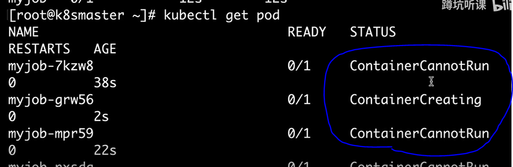

## 用k8s运行一次性任务


服务类（持续类运行容器）

工具类（busybox）

对工具类的容器就要用到（job）


vim myjob.yml

```
apiVersion: batch/v1
kind: Job
metadata:
  name: myjob
spec:
  template:
    metadata:
      name: myjob
    spec:
      containers:
      - name: hello
        image: busybox
        command: ["echo","hello k8s job"]
      restartPolicy: Never
```

执行

```
kubectl apply -f myjob.yml
```


#查看生成的pod

```
kubectl get job
```


使用

```
kubectl get pod 查看副本
```


发现状态是 完成，表示容器的任务已经完成。运行结束了（老版本是直接删除了）


输出一下日志

```
kubectl logs myjob-msp4v
```


## 2.    job 失败了怎么办


我们故意使他损坏

改为这样

vim myjob.yml

```
apiVersion: batch/v1
kind: Job
metadata:
  name: myjob1
spec:
  template:
    metadata:
      name: myjob1
    spec:
      containers:
      - name: hello1
        image: busybox
        command: ["invalid_command","hello k8s job"]
      restartPolicy: Never

```


先将之前创建的pod删掉

```
kubectl delete -f myjob.yml
```


创建新的pod（job）

```
kubectl apply -f myjob.yml
```

发现job不停在尝试重新（不能够运行）




#查看我们myjob  （pod）运行的状态

```
kubectl describe pod myjob
```


在状态栏显示了，我们的命令不可执行，有错误


先将之前创建的pod删掉

```
kubectl delete -f myjob.yml
```


将配置中的重启规则改为OnFailure（一定会错的情况下）

vim myjob.yml

```
apiVersion: batch/v1
kind: job
metadata:
  name: myjob
spec:
  template:
    metadata:
      name: myjob
    spec:
      containers:
      - name: hello
        image: busybox
        command: ["invalid_command","hello k8s job"]
      restartPolicy: OnFailure

```

#执行

```
kubectl apply -f myjob.yml
```

他也是失败的


#查看

```
kubectl describe pod myjob
```


状态是尝试这个值，后面的值变为1，容器失败就会重启（Never 和OnFailure的区别，是一个是无论什么情况都重启， 另一个是当程序运行失败，就重启）


