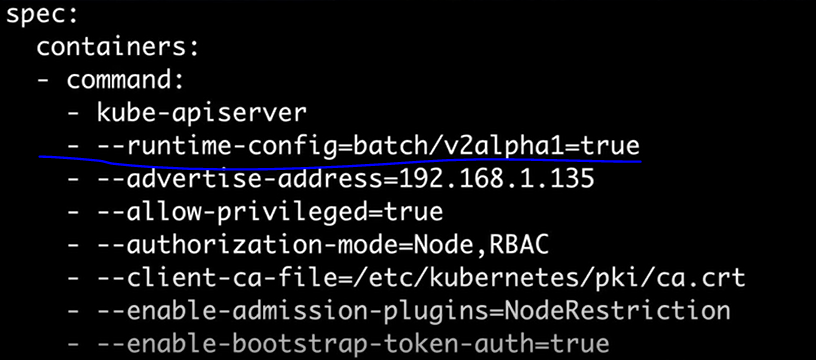

## 定时执行job


cron

```
* * * * *  分时日月周   命令
或者每周135
* * * * 1，2，3 
```


删除掉刚才的job文件


vim myjob.yml

```
apiVersion: batch/v2alpha1
kind: CronJob
metadata:
  name: hello
spec:
  schedule: "*/1 * * * *"
  jobTemplate:
    spec:
      template:
        spec:
          containers:
          - name: hello
            image: busybox
            command: ["echo","hello world!!!"]
          restartPolicy: OnFailure
```


```
kubectl apply -f myjob.yml
```

会报错，说版本不一样


vi /etc/kubernetes/manifests/kube-apiserver.yaml

添加：

```
- --runtime-config=batch/v2alpha1=true
```



```
#重启
systemctl restart  kubelet.service
```


#查看

```
kubectl get cronjobs.batch
```


查看

```
kubectl get jobs
```

