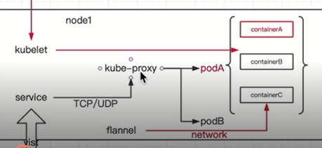
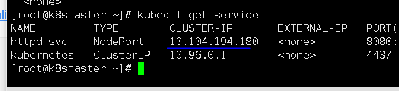
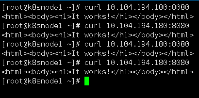
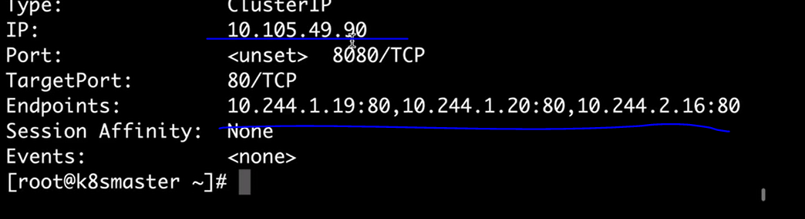
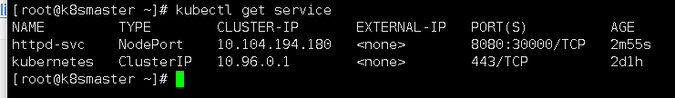
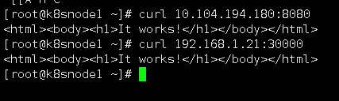
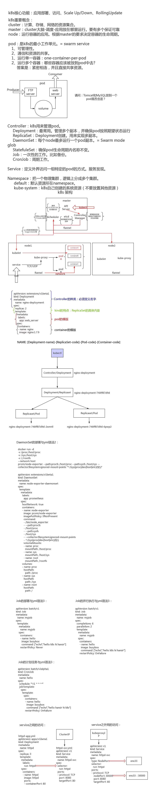

## 通过service 访问pod


## 客户端如何找到服务的



之前我们docker swarm通过VIP的形式去调度节点


逻辑上一个service代表着多个pod

通过使用固定的service的ip，去进行代理访问


我们之前的service 就有自己的ip

但k8s的service没有


我们来创建一个

vim httpd.yml

```
apiVersion: apps/v1beta1
kind: Deployment
metadata:
  name: httpd
spec:
  replicas: 3
  template:
    metadata:
      labels:
        run: httpd
    spec:
      containers:
      - name: httpd
        image: httpd
        ports:    //容器内的端口映射
        - containerPort: 80
```


应用

```
kubectl apply -f httpd-svc.yml
```

我们是访问不了的，因为没有映射处理


#给上一个容器映射端口

vim httpd-svc

```
apiVersion: v1
kind: Service
metadata:
  name: httpd-svc
spec:
  selector:
    run: httpd     //映射上一个容器的labal
  ports:
  - protocol: TCP
    port: 8080         //主机端口
    targetPort: 80     //容器端口
```


查看service

```
kubectl get service
```



通过这个ip就能访问到集群中的服务了

```
curl 10.104.194.180:8080
```




查看映射关系

```
kubectl descibe service httpd-svc
```




#查看后端副本的ip

```
kubectl get pod -o wide
```


调度的就是刚才创建的httpd的ip


## 外网访问


vim httpd.yml

```
apiVersion: v1
kind: Service
metadata:
  name: httpd-svc
spec:
  type: NodePort  
  selector:
    run: httpd    
  ports:
  - protocol: TCP
    nodePort: 30000      //访问物理机的30000端口
    port: 8080       //主机上访问虚拟ip的端口
    targetPort: 80     //容器端口映射
```




访问物理机的30000端口（主节点不参与工作，在其他节点上访问）

```
 curl 192.168.1.21:30000
```




