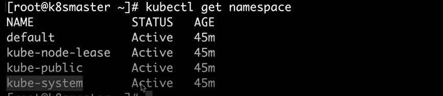
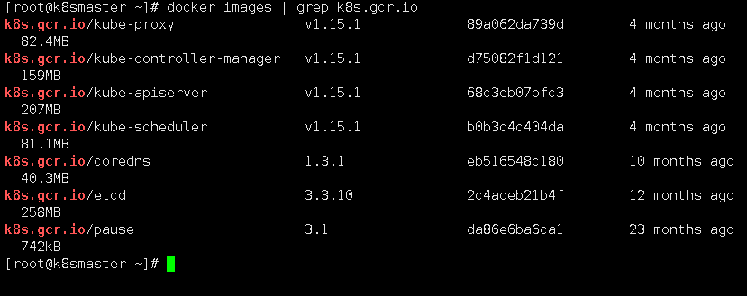

## 2组件及其概念


### k8s核心功能： 应用部署，访问，伸缩（Scale）    轮滚（RollingUpdate)

之前docker swarm群集创建容器时发现一直重启，是因为镜像中没有持续运行的前台参数

(我是在构建镜像中跑个小脚本无线ping自身)


## 重要概念

```
cluster :计算存储网络的整合一个集合，基于容器产生应用(比如我们现在3台主机就是在一个cluster中，可以集中调用资源和状态)

master：是cluster的大脑（调度和指挥集群的作用）（指定某个应用在什么地方运行）（可以是虚拟机也可以是物理机）（k8s可以启动多个master，但无法将节点提升为master），要有多个保证可靠性

node：负责运行容器及其 应用 接受master的指令（将容器的信息交给master进行汇报）

```

pod

```
pod：是工作中的最小单元，与swarm中的service相似  可管理行：提供了比容器更高层次抽象画的数据，pod就是一个service，master管理service 去调度大量的容器，当pod失效后，pod下的所有容器都失效了

在同一个pod中，容器可以通过pod进行通信，在一个空间使用相同的容器

同一个pod在同一个命名空间中  使用localhost进行通讯
1.单一运行   one-container-per-pod，即使只有一个容器，也要通过pod管理容器

2.多容器     紧密相连的服务器在同一个pod中（如共同存储介质的，FTP--httpd，nginx-php）
（同时进行工作的容器放到一起，调用的不用例如tomcat与mysql就不用放在一起）


3. controller：通过它管理pod。
     Deployment: 最常用，管理多个副本，并确保pod按照期望状态运行
     ReplicaSet:  //由Deployment创建。 来实现多个副本（自动）
     DaemonSet:  每个节点最多允许一个pod副本。 等于swarm群集的全局模式
     StatefuleSet：  确保pod生命周期内名称不变
     job:   一次性的工作，比如备份
     Cronjob: 周期工作
     
4。  service：定义外界访问的方式 ，把某一个pod提升为一个服务，（内部到外部的访问）（外部到内部的访问） （服务发现）负责端口映射


```

## namespect:  把一套物理集群，逻辑上分割为多个群集

```
 Pod 中的所有容器使用同一个网络 namespace，即相同的 IP 地址和 Port 空间。它们可以直接用 localhost  通信。同样的，这些容器可以共享存储，当 Kubernetes 挂载 volume 到 Pod，本质上是将 volume 挂载到 Pod  中的每一个容器。  
```


（案例，用户1用这套k8s资源创建了10个pod，用户2也用这套k8s创建了N个容器，将他们隔离开来）

查看命名空间

```
kubectl   get namespace
```



```
default          //创建资源时，如果不指定放那个命名空间，就会默认放在里面

kube-system              //k8S自己创建的资源，（不允许放入其他资源）

kube-node-lease        //节点资源的放置区

kube-public           //共享资源的放置区
```


## #组件的作用

#查看镜像

```
docker images | grep k8s.gcr.io
```



并不是所有主机都运行所有组件


## 1.  kube-apiserver

```
    K8S对外的唯一接口，提供HTTP/HTTPS RESTful API，即kubernetes API。所有的请求都需要经过这个接口进行通信。主要负责接收、校验并响应所有的REST（用户）请求，结果状态被持久存储在etcd当中，所有资源增删改查的唯一入口。
```

##  2. Schedule（调度器）

```
资源调度，负责决定将Pod放到哪个Node上运行。Scheduler在调度时会对集群的结构进行分析，当前各个节点的负载，以及应用对高可用、性能等方面的需求。
```

## 3. kube-controller-manager  

```
    负责维护集群的状态，比如故障检测、自动扩展、滚动更新等；

    负责管理集群各种资源，保证资源处于预期的状态。Controller Manager由多种controller组成，包括replication controller、endpoints controller、namespace controller、serviceaccounts controller等 。由控制器完成的主要功能主要包括生命周期功能和API业务逻辑，具体如下：

        生命周期功能：包括Namespace创建和生命周期、Event垃圾回收、Pod终止相关的垃圾回收、级联垃圾回收及Node垃圾回收等。
        API业务逻辑：例如，由ReplicaSet执行的Pod扩展等。
```

## 4. etcd 

```
    负责保存k8s 集群的配置信息和各种资源的状态信息，当数据发生变化时，etcd会快速地通知k8s相关组件。etcd是一个独立的服务组件，并不隶属于K8S集群。生产环境当中etcd应该以集群方式运行，以确保服务的可用性。

    etcd不仅仅用于提供键值数据存储，而且还为其提供了监听（watch）机制，用于监听和推送变更。在K8S集群系统中，etcd的键值发生变化会通知倒API Server，并由其通过watch API向客户端输出。
```

## 5 其他的

```
kube-proxy         //把service的数据转发到pod中，当有多个时，会形成调度群集（负责为Service提供cluster内部的服务发现和负载均衡）
coredns              //解析域名，kube在初始化时，创建的dns解析服务。
pause                //快速挂起容器
```


## 6. Node组件

Node主要负责提供容器的各种依赖环境，并接受Master管理。每个Node有以下几个组件构成。

```
 1、Kubelet
     kubelet是node的agent，当Scheduler确定在某个Node上运行Pod后，会将Pod的具体配置信息（image、volume等）发送给该节点的kubelet，kubelet会根据这些信息创建和运行容器，并向master报告运行状态。

2、Container Runtime
    每个Node都需要提供一个容器运行时（Container Runtime）环境，它负责下载镜像并运行容器。目前K8S支持的容器运行环境至少包括Docker、RKT、cri-o、Fraki等。

3、Kube-proxy
    service在逻辑上代表了后端的多个Pod，外借通过service访问Pod。service接收到请求就需要kube-proxy完成转发到Pod的。每个Node都会运行kube-proxy服务，负责将访问的service的TCP/UDP数据流转发到后端的容器，如果有多个副本，kube-proxy会实现负载均衡，有2种方式：LVS或者Iptables
```


# k8s 框架

```
（1）客户端提交创建请求，可以通过API Server的Restful API，也可以使用kubectl命令行工具。支持的数据类型包括JSON和YAML。
（2）API Server处理用户请求，存储Pod数据到etcd。

（3）调度器通过API Server查看未绑定的Pod。尝试为Pod分配主机。

（4）过滤主机 (调度预选)：调度器用一组规则过滤掉不符合要求的主机。比如Pod指定了所需要的资源量，那么可用资源比Pod需要的资源量少的主机会被过滤掉。

（5）主机打分(调度优选)：对第一步筛选出的符合要求的主机进行打分，在主机打分阶段，调度器会考虑一些整体优化策略，比如把容一个Replication Controller的副本分布到不同的主机上，使用最低负载的主机等。

（6）选择主机：选择打分最高的主机，进行binding操作，结果存储到etcd中。

（7）kubelet根据调度结果执行Pod创建操作： 绑定成功后，scheduler会调用APIServer的API在etcd中创建一个boundpod对象，描述在一个工作节点上绑定运行的所有pod信息。运行在每个工作节点上的kubelet也会定期与etcd同步boundpod信息，一旦发现应该在该工作节点上运行的boundpod对象没有更新，则调用Docker API创建并启动pod内的容器。
```

 

## 案例：

```
kubectl run httpd-app --image=httpd --replicas=2
```

含义：

```
httpd-app 是名字
--replicat=2  副本数量
```


#查看deployments

```
kubectl  get deployments
```


#查看pod（相当于查看service里副本在那里）

```
kubectl get pod -o wide
```


（以上命令的过程，kubect发送给API，API需要controller资源，去找到schoduler，收到了要创建两个容器，将容器调度到两节点上，跟节点上的kubelet交互部署在节点上）

（这些过程都会记录在etcd中）


ip就是etcd分配的，如果ip有问题就是etcd集群出问题了


## 


