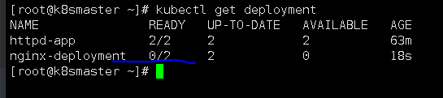
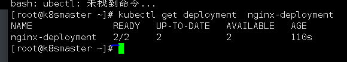
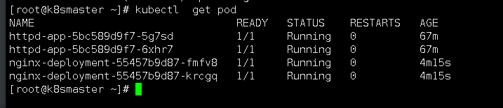

#   deployment命令部署


运行一个命令

```
kubectl  run  nginx-deployment --image=nginx --replicas=2
```

含义:

```
nginx-deployment    名称
--images=nginx      //指定镜像，
--replicas=2
```

查看

```
kubectl get deployment 
```



0/2是正在下载镜像



#查看当前创建的pod

```
kubectl get deployment  nginx-deployment
```


#查看所有pod中的容器

```
kubectl  get pod
```




## 名字的命名

NAME:[Deployment-name]-[ReplicaSet-code]-[Container-code]

docker ps -a查看容器名称


拆分开来

```
k8s_nginx-deployment_

nginx-deployment-55457b9d87-krcgq

_default_         //使用的默认的命名空间

01e34e3e-8607-473d-9e00-81d169949c52_0     //容器id随机码
```


#### 查看正在运行的容器副本（EVents记录了pod创建过程的步骤）

```
kubectl describe pod
```


#### 查看replicasets的详细信息

```
kubectl describe replicasets
```

#### 查看的作用（简略）

```
kubectl get replicasets
```

