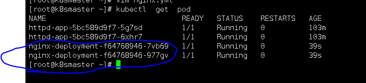

## 5创建deployment的两种方法


### #删除deployment模式的nginx-deploymentpod

```
kubectl delete deployment nginx-deployment
```

#查看使用deployment模式的pod 有几个

```
kubectl get deployment  
```

vim nginx.yml

```
apiVersion: apps/v1
kind: Deployment       
metadata:                
  name: nginx-deployment      
  labels:                   
    apps: nginx-dep          
spec:                  
  replicas: 2         
  selector:             
    matchLabels:        
      apps: nginx-dep  
  template:            
    metadata:
      labels:
        apps: nginx-dep  
    spec:
      containers:
      - name: nginx-dep 
        image: httpd     
```


为了方便理解里面的东西，在这说一下，apiVersion: apps/v1 是版本号，就这么写。

kind是你创建pod的类型Deployment是期望模式（保证群集中的副本数量为一定值）

metadata是定义这个pod的数据信息是什么,name是pod的名称，labels是pod的标签，apps:nginx-dep是pod的标签名称

spec和metadata的同级的 说明是给pod的参数值的设定， replicas: 2  是为pod设置副本数量为2， selector 这一块是设置容器标签，没用过。  spec是设置副本

#执行创建

```
kubectl apply -f nginx.yml
```


查看创建的服务

```
kubectl  get  pod
```




