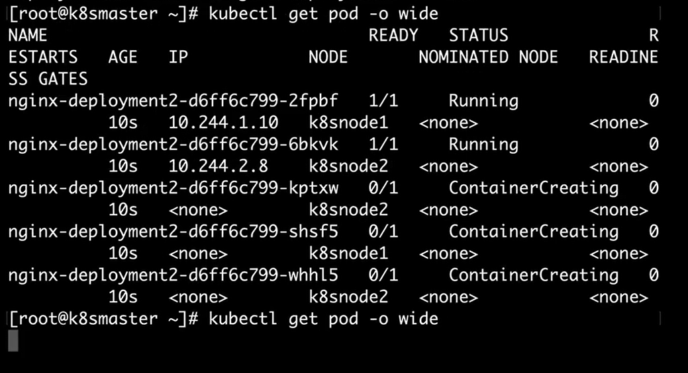
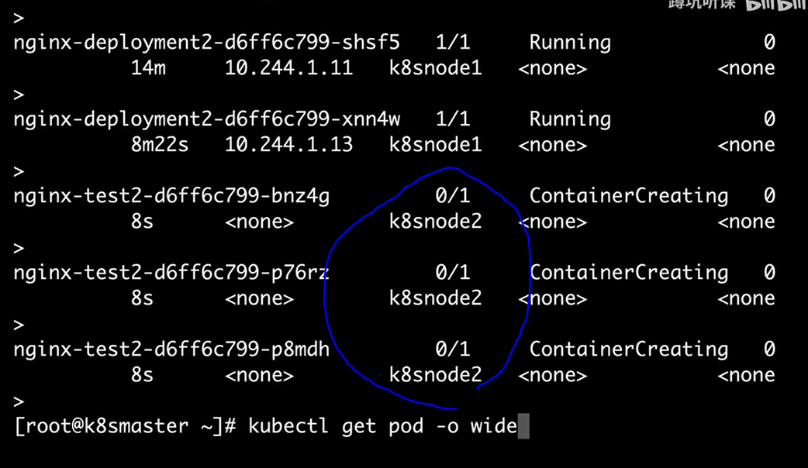

之前我们使用yml文件来实现副本的弹性伸缩


## Failover


vim nginx.yml

```
apiVersion: extensions/v1beta1
kind: Deploymente
metadata:
  name: nginx-deployment2
spec:
  replicas: 5   //修改副本到5
  template:
    metadata:
      labels:
        app: web_server
    spec:
      containers:
      - name: nginx
        images: nginx
```

#部署nginx副本（5台）

```
kubectl apply -f nginx.yml
```


### 查看nginx副本部署的位置

```
kubetl get pod -o wide
```



11 222   节点2上有3台主机

### 我们去模仿主机节点被破坏（直接将node2节点关闭）


### 变为节点2不可用


### 我们期望值为5，Failover的功能和swarm群集中的功能类似，就是当主机节点失效的时候，集群会把处于"期望"模式的主机迁移到有效的主机上继续运行，而global节点则会随节点的失效而消失


过一会就会发现，原本在节点2上的容器就会处于Terminating状态（无用）正在关闭，隔一段时间会关闭掉副本，然后在node1的节点上新建3个副本容器


如果把node2节点启动后，容器节点会恢复到node2节点上吗？

不会，和swarm群集一样，不会回去，直到下一次进行副本伸缩，才能回到none2主机


## 副本伸缩

vim nginx.yml

```
apiVersion: extensions/v1beta1
kind: Deployment
metadata:
  name: nginx-test-2     //修改项目名称
spec:
  replicas: 5   //修改副本到5
  template:
    metadata:
      labels:
        app: web_server
    spec:
      containers:
      - name: nginx
        images: nginx
```

执行

```
kubectl apply -f nginx.yml
```



发现新构建的3个副本都更新到了node2节点上了

（ps：  旧节点失效后，再恢复是会自动加入到集群节点中，但迁移的节点不会迁移回来）