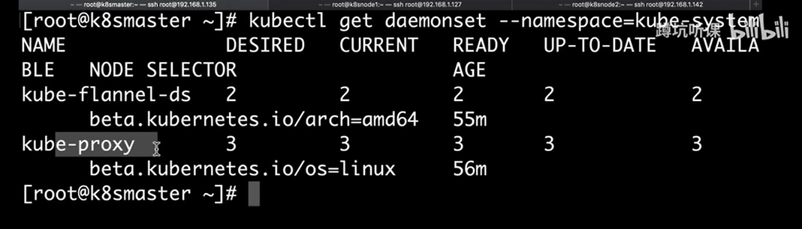
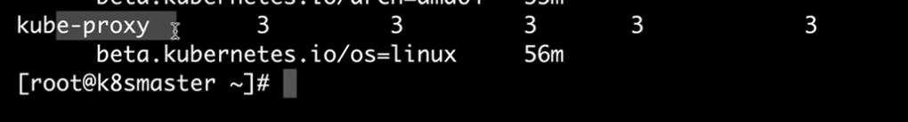
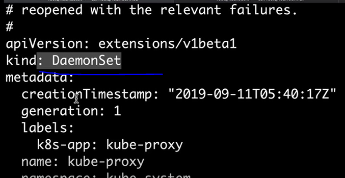
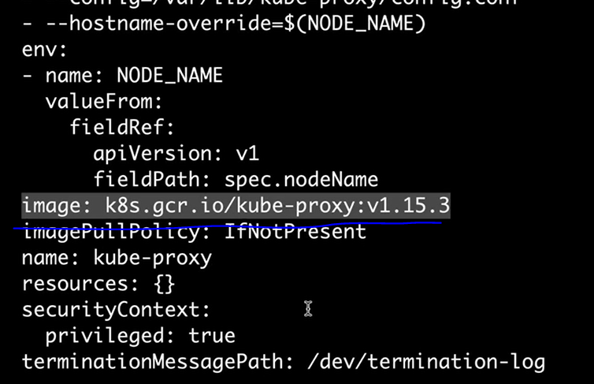
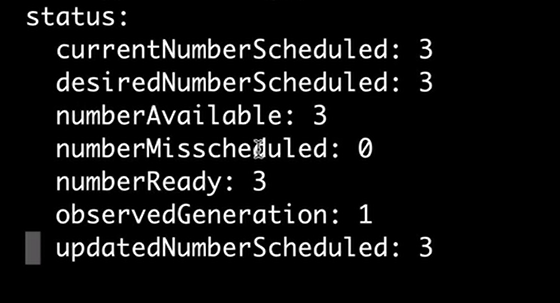

DaemonSet 的应用场景


之前我们用的期望


## DaemonSet 就相当于swarm的全局模式

（每台主机上只能运行一个副本）


查看当前运行的全局组件(我们现在系统中有两个默认的全局副本)

```
kubectl get daemonset --namespace=kube-system  //如果想要查看期望模式的，就把deamonset 换成deployment 
```




## flannel-ds:  我们之前使用flannel网络

```
https://raw.githubusercontent.com/coreos/flannel/master/Documentation/k8s-manifests/kube-flannel-legacy.yml
```

查看，他的类型

我复制下来了

```
  ...
apiVersion: extensions/v1beta1
kind: DaemonSet    //我们在部署kube-flannel-ds的时候，采用的就是全局模式的副本运行我们在部署kube-flannel-ds的时候，采用的就是全局模式的副本运行

metadata:
  name: kube-flannel-ds
  namespace: kube-system
  ... 

    
    ...
      hostNetwork: true    //使得pod特定的去使用host的网络（相当于=host模式） 主机的网络类型（容器对外单独通信
    ...
            
      containers:      //运行着flannel网络中的两个容器
      - name: kube-flannel
        image: quay.io/coreos/flannel:v0.10.0-amd64   //我们刚才下载的容器镜像
```


我们再来看第二个




## kube-proxy（我们无法通过查看yml文件直到他的信息，不过可以通过命令来查看）


#查看副本kube-proxy的yml文件

```
kubectl edit daemonset kube-proxy  --namespace=kube-system
```



可以看到proxy也是全局模式

然后再查看下面的容器




## status  ： 当前deamset 运行的状态




### 
