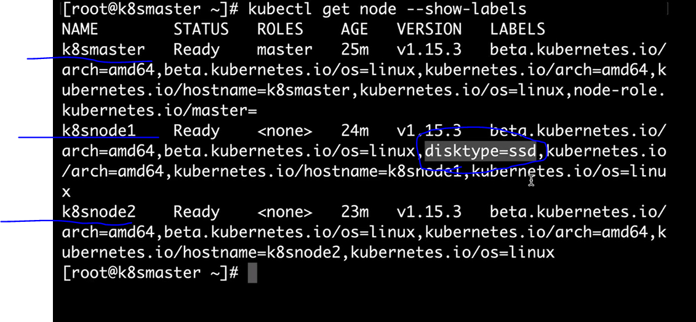
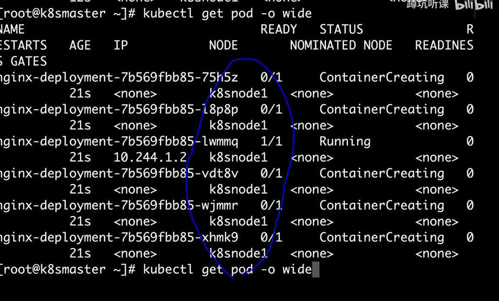
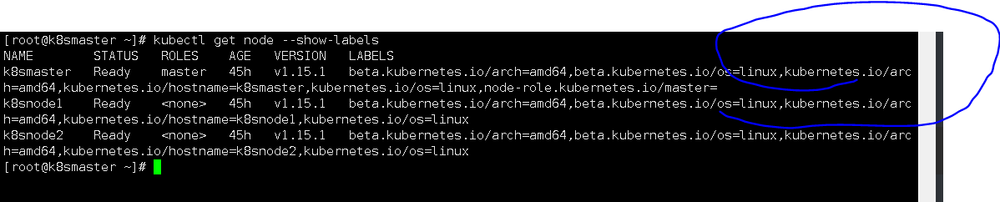
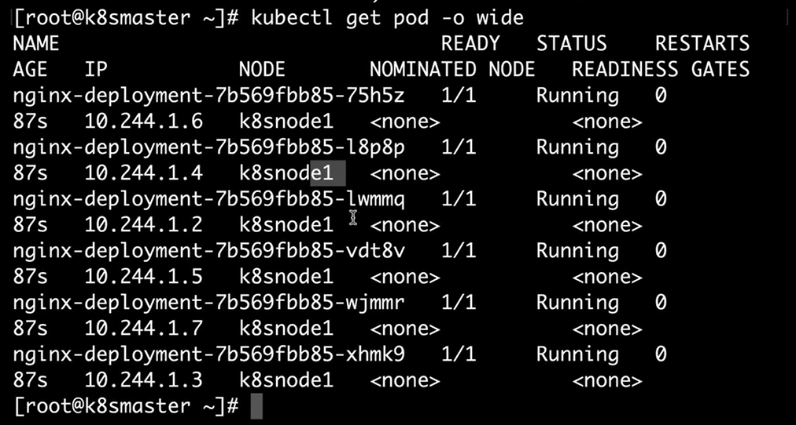

## 用label控制pod的位置

K8S与swarm对比

```
一个pod等于一个service
```

特殊情况下需要 将特定的副本指定到特定的node节点上


#### 给主机定义节点（打标签）

```
kubectl label node k8smaster disktype=ssd           //给节点1打标签为ssd
```

查看节点标签

```
kubectl get node --show-labels
```




vim nginx.yml

```
apiVersion: apps/v1beta1
kind: Deployment
metadata: 
  name: nginx-deployment
spec:  
  replicas: 6 
  template:
    metadata:
      labels:
        app: web_server
    spec:
      containers:
      - name: nginx
        image: nginx
      nodeSelector:         
        disktype: ssd
```

运行

```
kubectl apply -f nginx.yml
```


#查看

```
kubectl get pod -o wide
```



可以看到，部署的节点就都在node1节点上，这就是指定节点部署


## 如何去删除节点标签


```
kubectl label node k8smaster disktype-   //直接-号即可
```


查看

```
kubectl get node --show-labels
```




注意： 部署号的节点，即使节点标签被删除，容器依然会运行




### 如何将他们重新分开部署那

```
把        nodeSelector:      //选择者
          disktype: ssd     删除即可
```


## 如何将master上的容器进行迁移


给两个节点打标签

```
kubectl label node k8smaster disktype=ssd 

kubectl label node k8snode1 disktype=ssd1
```


#修改配置

vim nginx.yml

```
apiVersion: apps/v1beta1
kind: Deployment
metadata: 
  name: nginx-deployment
spec:  
  replicas: 6 
  template:
    metadata:
      labels:
        app: web_server
    spec:
      containers:
      - name: nginx
        image: nginx
      nodeSelector:         
        disktype: ssd1    //修改这个名称
```

重新应用

```
kubectl apply -f nginx.yml
```

