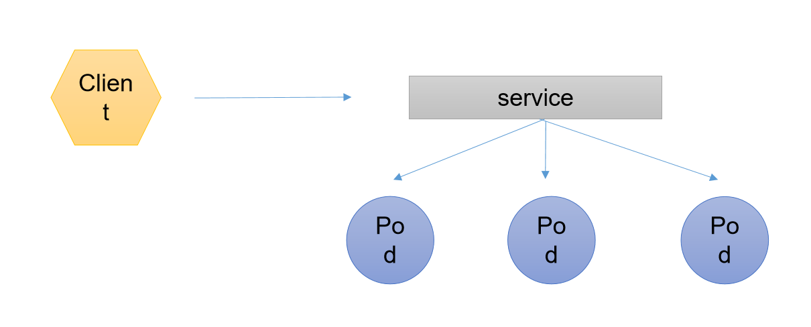

## 1 daemonset（全局pod)

```mysql
'daemonSet 确保全部(或一些)Node上运行的一个pod副本。'
#默认情况下会运行一个pod副本，也之后有一个
#可以是在一个pod中部署多个应用，也可以是多个pod

1.当有node加入群集时，也会为他们新增一个pod。
2.当有node从集群移除时，这些pod也会被回收。
3.删除daemonSet 将会删除它创建的索引pod

#使用daemonSet的一些典型用法
1. 运行集群存储daemon， 例如在每个node上运行glusterd、ceph
2. 在每个node上运行日志收集daemon，例如fluentd、logstash
3. 在每个node上运行监控daemon， 例如: Prometheus node exporter

#总结
	相当于swarm集群当中的全局service，每台node上都会有部署一个pod，随着集群的缩减而缩减
```

## 2 job.cronjob(一次性任务)

```mysql
#1. job 负责批处理任务，即仅仅执行一次的任务，它保证批吃了任务的一个或多个pod成功结束

案例 备份数据库
将备份数据库的代码封装在job中，然后去备份数据库的代码，job会检测这个job的脚本是否执行成功，如果不成功则重新执行。（可以设置重新执行次数）


#2. cronjob 管理基于时间的job
即
    1. 在给定的时间点只运行一次
    2. 周期性地在给定时间点运行
    

```


## 3 服务发现




```mysql
客户端要去想访问一组pod

service收集的pod是根据标签收集的
service有自己的ip:端口,去代理pod
客户端访问service的ip:端口进行访问。
#默认规则RR  轮询

案例

				lvs
				|
   -------------------------------
   |              |              |
squid1          squid2        squid3
   |              |              |
   -------------------------------
apache-fpm1   apache-fpm2   apache-fpm3 
    |             |              |
    ----------------------------- 
                  |
 			  'mysql'
 				
#通过控制器控制				
1 先把mysql封装成一个pod （StatefullSet)
2 使用 deployment 创建apache期望值为3
3 使用 deployment 创建squid期望值为3
4 lvs 通过集群本身的功能进行调度

#之前我们知道deployment 的容器在退出，重新生成之后的ip地址是会变的，我们又需要用squid去反向代理我们的web服务

#但是用(StatefullSet)去构建php-fpm又没有必要，这时我们就要创建一个service-php-fpm，它会绑定我们3个容器的标签


#如下
				lvs
				|
	       #service-squid   nodeport(暴露端口)
	              |
   -------------------------------
   |              |              |
squid1          squid2        squid3  #pod1
   |              |              |
   -------------------------------
                  |
           #service-fpm-php  默认访问轮询      
                  |
   -------------------------------
apache-fpm1   apache-fpm2   apache-fpm3  #pod2
    |             |              |
    ----------------------------- 
                  |
 			  'mysql'              #pod3

#我们的squid中写的代理地址，就是#service-fpm-php的地址，以后即使容器坏了，service还在，就没事，容器自动生成新的即可

#在apache-fpm(pod) 中直接写mysql的地址即可
```


