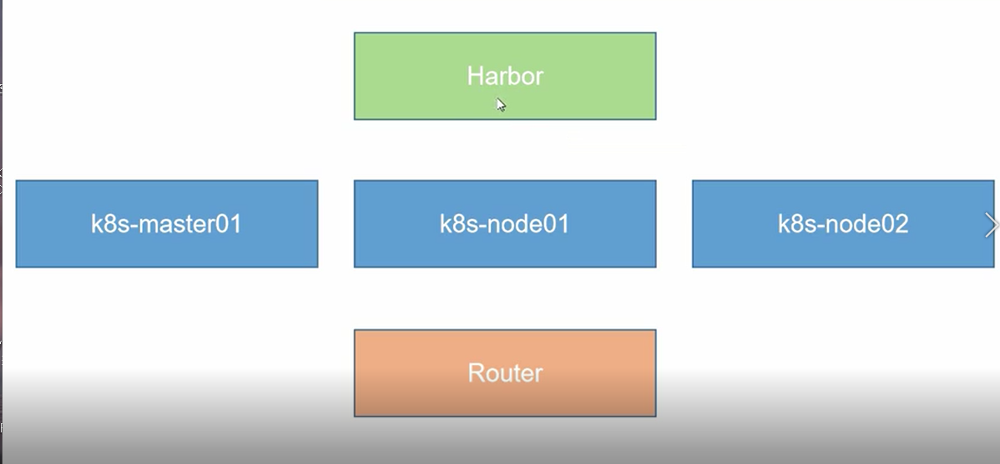
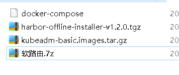
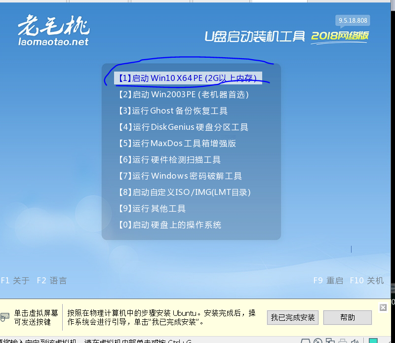
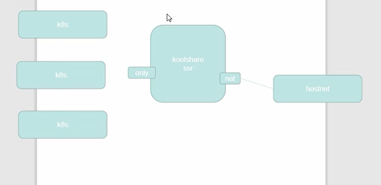
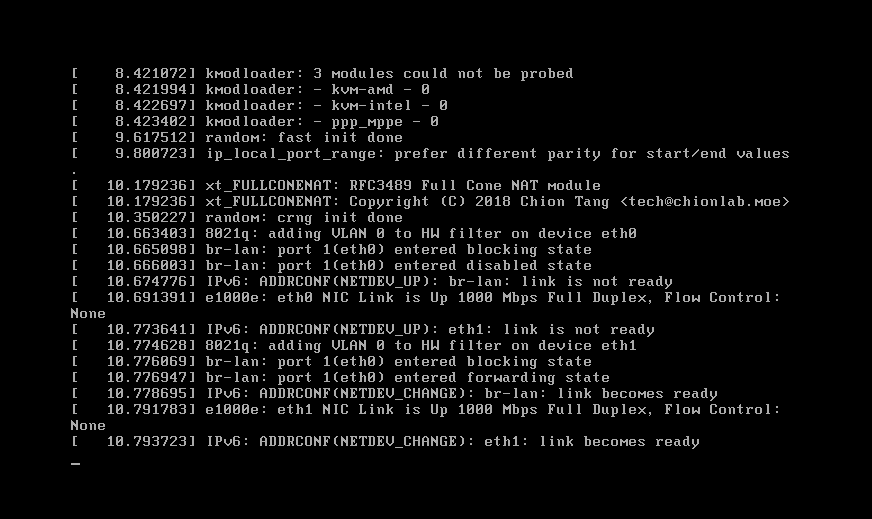
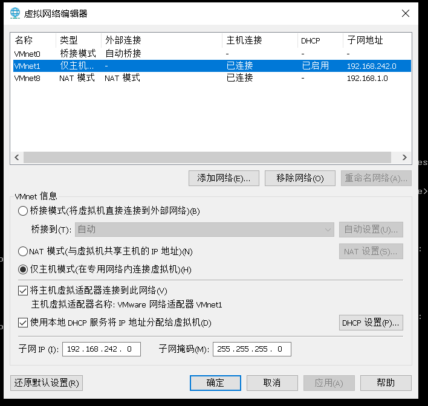
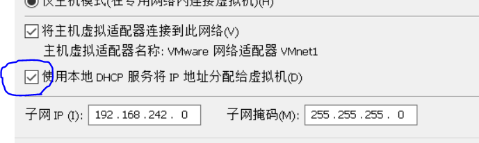
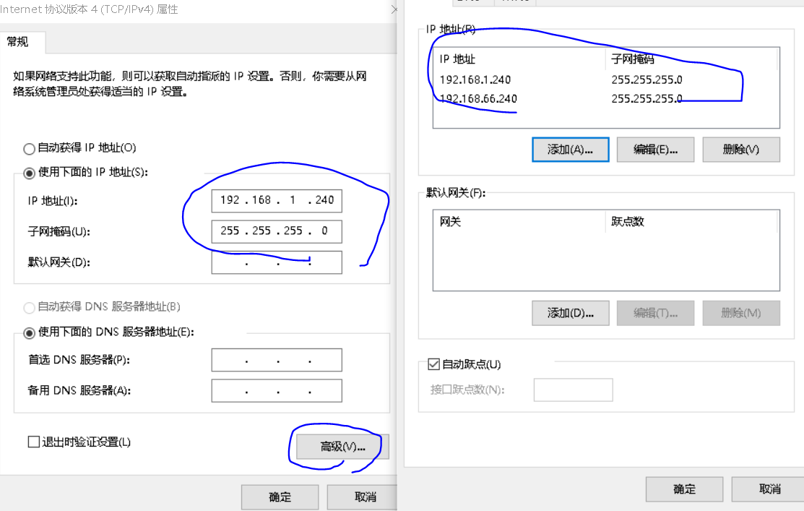
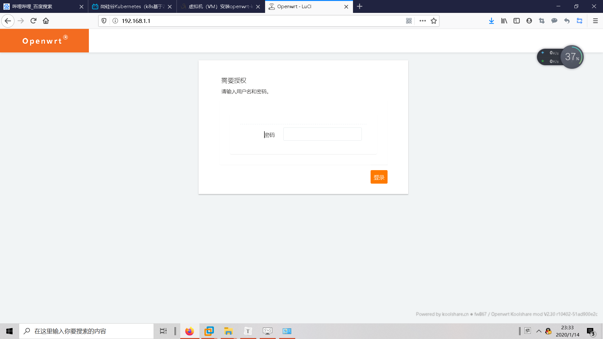
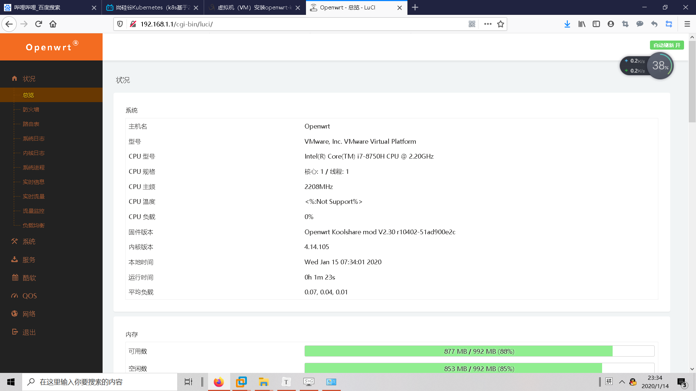

## 部署一个kubenetes




### 我们需要部署的是什么

```mysql
 1主两从         #后续会改高可用3从节点

harbor 私有仓库   #（存放镜像）

软路由 router  #我们采用的安装方式kubeadm,官方提供的安装工具，但kubeadm是放在谷歌服务器上的，如果不能科学上网，则需要导入镜像。
```

## （我们整个群集都使用的是centos7)


## 1. 软路由router  （如果你已经科学上网了就跳过这步）

```mysql
为什么要，软路由那？ #这个东西，简单来说就是翻墙，因为国内的网络默认情况下是访问不到谷歌的浏览器的

#部署的方法
https://www.cnblogs.com/fanqisoft/p/11493944.html
```

我们打开软件包

```
Kubernetes 安装所需软件.zip.003
```

里面有4个压缩文件



### 打开软路由（解压缩后得到）


```
先用虚拟机挂载镜像laomaotao
```

### #首先我们根据需求来配置一个新的虚拟机

### #您必须，根据下面的图片来配置，一步不能差，不然出现任何错误，都和文档没关系


### #挂载老毛桃镜像（PE）





### #登陆成功后，替换镜像ssr，写入硬盘


### #关闭虚拟机与镜像的连接，并退出调整虚拟机资源（因为是管网络的，不需要太高的资源）

### 

```
将cpu和内存都调整为1
```

### #添加一块网卡


```mysql
将网卡1 调整为主机模式
将网卡2 调整为NAT模式
#为什么这样
```




```mysql
网卡1 面向k8s群集的网络，(仅主机网络)
网卡2 使用NAT模式来进行上网，这里一来k8s群集的上网途径就是通过ssr 软路由来进行通信的
```

## 开机




## 设置

```
openwrt-koolshare的默认网段是192.168.1.1，修改宿主机的VM仅主机模式的网卡的IPV4地址为192.168.1.240，192.168.66.240
```

### 查看仅主机模式的网卡

#可以看到仅主机网络的网卡是vmnet1



#关闭dhcp功能



### 设置宿主机上的这个网卡地址

```
ncpa.cpl
```




### #重启ssr虚拟机

主机访问

```
192.168.1.1
```



### #密码

```
koolshare
```




### 完成


## 2. 构建harbor  


