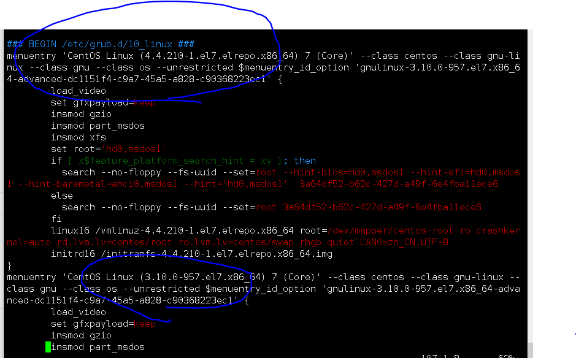

## 所有节点

```mysql
#部署依赖源
wget -O/etc/yum.repos.d/aliyun-yilai.repo http://mirrors.aliyun.com/repo/Centos-7.repo


#域名解析

cat <<EOF>>/etc/hosts
192.168.1.20 k8smaster
192.168.1.21 k8snode1
192.168.1.22 k8snode2
EOF

#设置主机名
temp=$(ifconfig ens33 | grep "inet " | awk -F " " '{print $2}')
 if [ $temp = 192.168.1.20 ];then         
   hostname  k8smaster
   bash
  elif  [ $temp = 192.168.1.21 ];then
      hostname  k8snode1
      bash
  elif  [ $temp = 192.168.1.22 ];then
      hostname  k8snode2
      bash
  fi


#安装依赖环境
yum -y install conntrack ntpdate ntp ipvsadm ipset jq iptables curl sysstat libseccomp wget net-tools git

#设置防火墙为iptables并设置空规则
systemctl stop firewalld && systemctl disable firewalld
yum -y install iptables-services && systemctl start iptables && systemctl enable iptables   && iptables -F && service iptables save


#关闭selinux
#关闭swarm虚拟内存（防止容器在虚拟内存中运行)
swapoff -a && sed -i '/ swap / s/^\(.*\)$/#\1/g' /etc/fstab
setenforce 0 && sed -i 's/^SELINUX=.*/SELINUX=disabled/' /etc/selinux/config


#调整内核参数，对于k8s

cat > kubernetes.conf <<EOF 
net.bridge.bridge-nf-call-iptables=1 
net.bridge.bridge-nf-call-ip6tables=1 
net.ipv4.ip_forward=1 
net.ipv4.tcp_tw_recycle=0
vm.swappiness=0 # 禁止使用 swap 空间，只有当系统 OOM 时才允许使用它
vm.overcommit_memory=1 # 不检查物理内存是否够用
vm.panic_on_oom=0 # 开 启 OOM
fs.inotify.max_user_instances=8192 
fs.inotify.max_user_watches=1048576 
fs.file-max=52706963 fs.nr_open=52706963 
net.ipv6.conf.all.disable_ipv6=1 
net.netfilter.nf_conntrack_max=2310720 
EOF

#刷新内核参数
cp kubernetes.conf /etc/sysctl.d/kubernetes.conf 
sysctl -p /etc/sysctl.d/kubernetes.conf


#调整系统时区 中国上海
timedatectl set=timezone Asia/Shanghai
#将当前utc时间写入硬件时钟
timedatectl set-local-rtc 0
#重启依赖于系统时间的服务
 systemctl restart rsyslog
 systemctl restart crond
 
 
 
 
 #关闭系统不需要的服务
 systemctl stop postfix && systemctl disable postfix
 
 
 
 
 
 
 #设置rsyslogd和systemd journald  (systemd journald更好一点)
 mkdir /var/log/journal # 持久化保存日志的目录
mkdir /etc/systemd/journald.conf.d    #配置文件存放目录

#创建配置文件
cat > /etc/systemd/journald.conf.d/99-prophet.conf <<EOF     
[Journal]
# 持久化保存到磁盘
Storage=persistent
# 压缩历史日志
Compress=yes
SyncIntervalSec=5m RateLimitInterval=30s RateLimitBurst=1000
# 最大占用空间 10G SystemMaxUse=10G
# 单日志文件最大 200M SystemMaxFileSize=200M
# 日志保存时间 2 周
MaxRetentionSec=2week
syslog ForwardToSyslog=no
EOF

# 不将日志转发到  
systemctl restart systemd-journald


# 升级系统内核为 4.44

#CentOS 7.x 系统自带的 3.10.x 内核存在一些 Bugs，导致运行的 Docker、Kubernetes 不稳定，例如： rpm -Uvh http://www.elrepo.org/elrepo-release-7.0-3.el7.elrepo.noarch.rpm


rpm -Uvh http://www.elrepo.org/elrepo-release-7.0-4.el7.elrepo.noarch.rpm

# 安装完成后检查 /boot/grub2/grub.cfg 中对应内核 menuentry 中是否包含 initrd16 配置，如果没有，再安装一次！

# 设置开机从新内核启动
yum --enablerepo=elrepo-kernel install -y kernel-lt 

#设置默认启动的内核
grub2-set-default 'CentOS Linux (4.4.189-1.el7.elrepo.x86_64) 7 (Core)'

```

## #完成之后关机，调整虚拟机配置为（4G 内存  2核CPU）


### #查看内核版本

```
vim /boot/grub2/grub.cfg 
```

