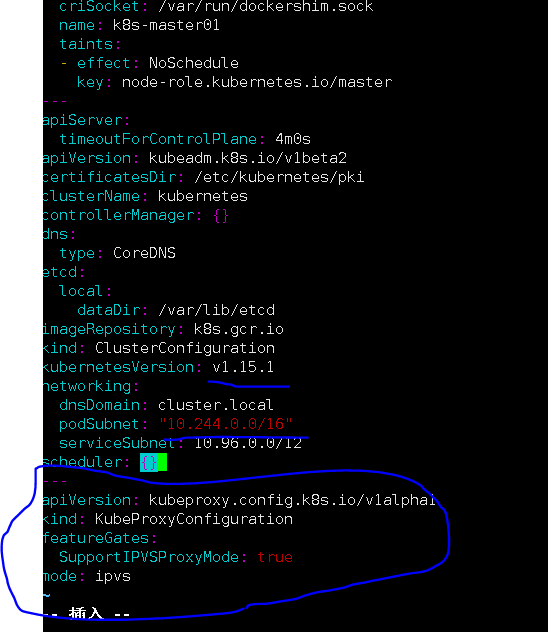

```mysql
#uname -r 检查内核版本 

#kube-proxy开启ipvs的前置条件
modprobe br_netfilter

cat > /etc/sysconfig/modules/ipvs.modules <<EOF 
#!/bin/bash
modprobe -- ip_vs 
modprobe -- ip_vs_rr 
modprobe -- ip_vs_wrr 
modprobe -- ip_vs_sh
modprobe -- nf_conntrack_ipv4 
EOF

chmod 755 /etc/sysconfig/modules/ipvs.modules && bash 
/etc/sysconfig/modules/ipvs.modules && lsmod | grep -e ip_vs -e nf_conntrack_ipv4


#安装 Docker 软件

yum install -y yum-utils device-mapper-persistent-data lvm2

yum-config-manager \
--add-repo \
http://mirrors.aliyun.com/docker-ce/linux/centos/docker-ce.repo yum update -y && yum install -y docker-ce


## 创 建 /etc/docker 目 录
mkdir /etc/docker

# 配 置 daemon.
cat > /etc/docker/daemon.json <<EOF
{
"exec-opts": ["native.cgroupdriver=systemd"], "log-driver": "json-file",
"log-opts": {
"max-size": "100m"
}
} 
EOF
mkdir -p /etc/systemd/system/docker.service.d

# 重启docker服务
systemctl daemon-reload && systemctl restart docker && systemctl enable docker
```

## #添加免密登陆 （所有主机）

```
yum -y install expect

ssh-keygen -t rsa -P "" -f ~/.ssh/id_rsa
```

### 所有主机执行下面3个

```mysql
cat << EOF > /test1
#!/bin/expect
spawn ssh-copy-id root@192.168.1.20 -o StrictHostKeyChecking=no
expect "root@192.168.1.20's password: "
send "123.com\r"
interact
EOF
expect /test1 
```

```mysql
cat << EOF > /test2
#!/bin/expect
spawn ssh-copy-id root@192.168.1.21 -o StrictHostKeyChecking=no
expect "root@192.168.1.21's password: "
send "123.com\r"
interact
EOF
expect /test2 
```

```mysql
cat << EOF > /test3
#!/bin/expect
spawn ssh-copy-id root@192.168.1.22 -o StrictHostKeyChecking=no
expect "root@192.168.1.22's password: "
send "123.com\r"
interact
EOF
expect /test3
```


## #安装 Kubeadm （所有主机）

```mysql
cat <<EOF > /etc/yum.repos.d/kubernetes.repo
[kubernetes]
name=Kubernetes 
baseurl=http://mirrors.aliyun.com/kubernetes/yum/repos/kubernetes-el7-x86_64 
enabled=1
gpgcheck=0 
repo_gpgcheck=0
EOF

#建立缓存
yum makecache 

#安装
yum -y install kubeadm-1.15.1 kubectl-1.15.1 kubelet-1.15.1 

systemctl enable kubelet.service
```


## 初始化主节点（master）

```mysql
#初始化模板
kubeadm config print init-defaults > kubeadm-config.yaml 


#将导入的kubeadm-config.yaml 中的数据修改为下面的数据（手动）
vim kubeadm-config.yaml 
#编辑配置
localAPIEndpoint:
    advertiseAddress: 192.168.1.20    #修改为master节点
kubernetesVersion: v1.15.1        #修改 版本号
networking:
  podSubnet: "10.244.0.0/16"   #添加
  serviceSubnet: 10.96.0.0/12     
    name: k8s-master01           #修改为你设置的hosts域名解析

  
#下面的都添加到scheduler: {}下面
---
apiVersion: kubeproxy.config.k8s.io/v1alpha1 
kind: KubeProxyConfiguration
featureGates:
  SupportIPVSProxyMode: true 
mode: ipvs


```

###  





## #初始化之前要下载镜像

```
kubeadm config images list --kubernetes-version=v1.15.1
```

输出

```mysql
k8s.gcr.io/kube-apiserver:v1.15.1
k8s.gcr.io/kube-controller-manager:v1.15.1
k8s.gcr.io/kube-scheduler:v1.15.1
k8s.gcr.io/kube-proxy:v1.15.1
k8s.gcr.io/pause:3.1
k8s.gcr.io/etcd:3.3.10
k8s.gcr.io/coredns:1.3.1
#这些是我们需要的镜像，但是国内网络不好，下载不了
#所以我们去谷歌下载
```

下面我们都是使用mirrorgooglecontainers（谷歌上下载的）

```mysql
#master组件 
docker pull mirrorgooglecontainers/kube-apiserver:v1.15.1
docker pull mirrorgooglecontainers/kube-controller-manager:v1.15.1
docker pull mirrorgooglecontainers/kube-scheduler:v1.15.1
docker pull mirrorgooglecontainers/kube-proxy:v1.15.1
docker pull mirrorgooglecontainers/pause:3.1


#下面这俩谷歌没有，用阿里云的
docker pull registry.cn-hangzhou.aliyuncs.com/google_containers/etcd:3.3.10
docker pull registry.cn-hangzhou.aliyuncs.com/google_containers/coredns:1.3.1
```


### 修改标签及删除镜像

```mysql
#打标签
#api server
docker tag mirrorgooglecontainers/kube-apiserver:v1.15.1  k8s.gcr.io/kube-apiserver:v1.15.1

#kube-controller-manager
docker tag mirrorgooglecontainers/kube-controller-manager:v1.15.1 k8s.gcr.io/kube-controller-manager:v1.15.1

#kube-scheduler
docker tag mirrorgooglecontainers/kube-scheduler:v1.15.1 k8s.gcr.io/kube-scheduler:v1.15.1

#kube-proxy
docker tag mirrorgooglecontainers/kube-proxy:v1.15.1 k8s.gcr.io/kube-proxy:v1.15.1

#pause
docker tag mirrorgooglecontainers/pause:3.1 k8s.gcr.io/pause:3.1

#etcd
docker tag registry.cn-hangzhou.aliyuncs.com/google_containers/etcd:3.3.10  k8s.gcr.io/etcd:3.3.10
#coredns
docker tag registry.cn-hangzhou.aliyuncs.com/google_containers/coredns:1.3.1  k8s.gcr.io/coredns:1.3.1


#清除镜像
docker rmi registry.cn-hangzhou.aliyuncs.com/google_containers/coredns:1.3.1
docker rmi registry.cn-hangzhou.aliyuncs.com/google_containers/etcd:3.3.10 

docker images | grep mirrorgooglecontainers  | awk '{print "docker rmi", $1":"$2}' | sh -x
```


## ps，我自己设置有私有仓库harbor，直接拉取镜像


### #指定仓库位置（所有主机）

vim /usr/lib/systemd/system/docker.service

```mysql 
在  ExecStart=/usr/bin/dockerd -H fd:// --containerd=/run/containerd/containerd.sock  之后添加  '--insecure-registry 192.168.1.2'

#重启服务
systemctl daemon-reload 
systemctl restart docker
```


#登陆

```mysql
#登陆
docker login 192.168.1.2

#用户名及密码
admin

123.com
```

#拉取镜像

```mysql
docker pull  192.168.1.2/test/kube-controller-manager:v1.15.1
docker pull  192.168.1.2/test/kube-apiserver:v1.15.1
docker pull  192.168.1.2/test/kube-scheduler:v1.15.1
docker pull  192.168.1.2/test/kube-proxy:v1.15.1
docker pull 192.168.1.2/test/coredns:1.3.1
docker pull  192.168.1.2/test/etcd:3.3.10
docker pull 192.168.1.2/test/pause:3.1


#打标签
docker tag  192.168.1.2/test/kube-controller-manager:v1.15.1 k8s.gcr.io/kube-controller-manager:v1.15.1
docker tag  192.168.1.2/test/kube-apiserver:v1.15.1 k8s.gcr.io/kube-apiserver:v1.15.1
docker tag  192.168.1.2/test/kube-scheduler:v1.15.1 k8s.gcr.io/kube-scheduler:v1.15.1
docker tag  192.168.1.2/test/kube-proxy:v1.15.1 k8s.gcr.io/kube-proxy:v1.15.1
docker tag  192.168.1.2/test/coredns:1.3.1 k8s.gcr.io/coredns:1.3.1
docker tag  192.168.1.2/test/etcd:3.3.10  k8s.gcr.io/etcd:3.3.10
docker tag  192.168.1.2/test/pause:3.1   k8s.gcr.io/pause:3.1


#删除多余的镜像
docker images | grep 192.168.1.2/test/  | awk '{print "docker rmi", $1":"$2}' | sh -x


```


### #退出私有仓库登陆

```
 docker logout 192.168.1.2
```


